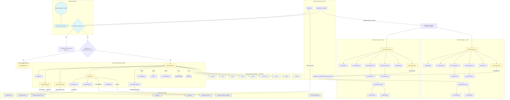

```mermaid
flowchart TD

%% Kierunek: Top-Down dla hierarchii
%% Style klas
classDef updated fill:#fffbcc,stroke:#d4a373,stroke-width:2px;
classDef auth fill:#e0f7fa,stroke:#006064,stroke-width:1px;
classDef api fill:#e8eaf6,stroke:#3949ab,stroke-width:1px;
classDef ui fill:#f1f5f9,stroke:#475569,stroke-width:1px;

%% Warstwa serwerowa (Astro)
subgraph Server["Warstwa Serwerowa (Astro)"]
  AppPage("(app.astro)")
  PublicMain("(page/[user_url].astro)")
  PublicProject("(page/[user_url]/projects/[project_id].astro)")
end

%% Moduł autentykacji
subgraph Auth["Moduł Autentykacji"]
  AuthCheck{"Użytkownik zalogowany?"}
  SupaSession(("Sesja Supabase (cookies)"))
  SupaLocals["Astro.locals.supabase"]
end
class AuthCheck,SupaSession,SupaLocals auth

%% Panel Administracyjny (React)
subgraph Admin["Panel Administracyjny (React)"]
  AD["AdminDashboard"]:::updated
  AH["AppHeader"]
  PSC["PageSettingsCard"]:::updated
  PCC["PageContentCard"]:::updated
  PC["ProjectsCard"]:::updated
  CPM["CreateProjectModal"]
  PLI["ProjectListItem"]
  RC["ReorderControls"]
  CD["ConfirmDialog"]
  EL["ErrorList"]
  FUB["FileUploadButton"]
  IET["InlineEditText"]
  UFU[["useFileUpload"]]
  UToast[["useToast"]]
end

%% Setup (pierwsza konfiguracja)
subgraph Setup["Początkowa konfiguracja"]
  IPS["InitialPageSetup"]:::updated
end

%% UI wspólne (Shadcn/ui)
subgraph UIShared["Komponenty Współdzielone UI (Shadcn)"]
  UI_btn["ui/button"]
  UI_card["ui/card"]
  UI_input["ui/input"]
  UI_select["ui/select"]
  UI_dialog["ui/dialog"]
  UI_alert["ui/alert-dialog"]
  UI_sonner["ui/sonner"]
  UI_label["ui/label"]
  UI_badge["ui/badge"]
end
class UI_btn,UI_card,UI_input,UI_select,UI_dialog,UI_alert,UI_sonner,UI_label,UI_badge ui

%% Publiczne motywy – Ocean
subgraph PublicOcean["Publiczne Motywy – Ocean"]
  OLayout["OceanThemeLayout"]:::updated
  OHeader["PageHeader"]
  OContact["ContactSection"]
  OEdu["EducationSection"]
  OEduItem["EducationItem"]
  OExp["ExperienceSection"]
  OExpItem["ExperienceItem"]
  OSkills["SkillsSection"]
  OProjList["ProjectsListPublic"]:::updated
  OProjLayout["OceanProjectLayout"]
  OProjHeader["ProjectHeader"]
  OProjDetails["ProjectDetails"]
end

%% Publiczne motywy – Earth
subgraph PublicEarth["Publiczne Motywy – Earth"]
  ELayout["EarthThemeLayout"]:::updated
  EHeader["PageHeader"]
  EContact["ContactSection"]
  EEdu["EducationSection"]
  EEduItem["EducationItem"]
  EExp["ExperienceSection"]
  EExpItem["ExperienceItem"]
  ESkills["SkillsSection"]
  EProjList["ProjectsListPublic"]:::updated
  EProjLayout["EarthProjectLayout"]
  EProjHeader["ProjectHeader"]
  EProjDetails["ProjectDetails"]
end

%% API (Astro endpoints) – powiązania danych
subgraph API["API (Astro Endpoints)"]
  APages["/api/pages"]:::api
  APagesData["/api/pages/data"]:::api
  APagesUrl["/api/pages/url"]:::api
  AProjects["/api/projects"]:::api
  AProjectsId["/api/projects/[project_id]"]:::api
  AProjectsReorder["/api/projects/reorder"]:::api
  AProjectsData["/api/projects/[project_id]/data"]:::api
  ATemplates["/api/templates/[type]"]:::api
end

%% Połączenia – App i Auth
SupaSession --- SupaLocals
AppPage --> AuthCheck
AuthCheck -- "nie" --> RedirectHome["Przekierowanie na stronę publiczną"]
AuthCheck -- "tak" --> HasPage{"Użytkownik ma skonfigurowaną stronę?"}
HasPage -- "nie" --> IPS
HasPage -- "tak" --> AD

%% App → API (z cookies)
AppPage -- "fetch (z cookies)" --> APages

%% AdminDashboard – kompozycja
AD --> AH
AD --> PSC
AD --> PCC
AD --> PC
AD --> CPM
PC --> PLI
PC --> RC
AD -. używa .-> CD
AD -. używa .-> EL
AD -. używa .-> FUB
AD -. hook .-> UFU
AD -. hook .-> UToast

%% Admin → UI (Shadcn)
AD -.-> UI_btn
AD -.-> UI_card
AD -.-> UI_input
AD -.-> UI_select
AD -.-> UI_dialog
AD -.-> UI_alert
AD -.-> UI_sonner
AD -.-> UI_label
AD -.-> UI_badge

%% Admin → API
PCC -- "Upload YAML strony" --> APagesData
PSC -- "Zmień motyw" --> APages
PSC -- "Zmień URL" --> APagesUrl
PC -- "CRUD projekty" --> AProjects
PC -- "Reorder" --> AProjectsReorder
PLI -- "Usuń/Edytuj" --> AProjectsId
CPM -- "Upload YAML projektu" --> AProjectsData

%% Publiczna strona – dane i motywy
PublicMain --> SupaLocals
PublicMain -- "Supabase: pages + projects" --> ViewModel["ViewModel (PageData + Projects + Theme)"]
ViewModel --> OLayout
ViewModel --> ELayout

%% Layouty → sekcje (Ocean)
OLayout --> OHeader
OLayout --> OContact
OLayout --> OEdu
OEdu --> OEduItem
OLayout --> OExp
OExp --> OExpItem
OLayout --> OSkills
OLayout --> OProjList

%% Layouty → sekcje (Earth)
ELayout --> EHeader
ELayout --> EContact
ELayout --> EEdu
EEdu --> EEduItem
ELayout --> EExp
EExp --> EExpItem
ELayout --> ESkills
ELayout --> EProjList

%% Przejście do strony projektu
OProjList -- "Klik: project_id" --> PublicProject
EProjList -- "Klik: project_id" --> PublicProject

%% Strona projektu → layouty
PublicProject --> OProjLayout
PublicProject --> EProjLayout
OProjLayout --> OProjHeader
OProjLayout --> OProjDetails
EProjLayout --> EProjHeader
EProjLayout --> EProjDetails
```